# 🚀 Dify 炒股分析系统

<div align="center">


**基于 FastAPI 和 AKShare 的专业股票分析系统，为 Dify 工作流提供强大的股票数据分析服务**

[快速开始](#快速开始) • [API 文档](#api接口) • [部署指南](#部署指南) • [MCP 集成](#mcp集成)

</div>

---

## ✨ 功能特性

### 🎯 核心功能

- 🚀 **多市场支持**: A 股、港股、美股、ETF 等全市场覆盖
- 📊 **专业技术指标**: MA、MACD、KDJ、RSI、布林带等 20+技术指标
- 📈 **智能分析报告**: AI 驱动的趋势分析、成交量分析、风险评估
- 🎨 **可视化图表**: 实时 K 线图、技术指标图表展示
- 🔍 **支撑阻力位**: 自动识别关键价位和交易机会

### 🛡️ 安全与性能

- 🔐 **Bearer Token 认证**: 企业级安全认证机制
- ⚡ **高性能缓存**: Redis 缓存优化，响应速度<2 秒
- 🔄 **智能重试**: 多重容错机制，确保数据获取稳定性
- 📊 **并发处理**: 支持 10+并发请求处理
- 🌐 **跨域支持**: 完整的 CORS 配置

### 🔧 集成能力

- 🤖 **Dify 工作流**: 无缝集成 Dify 平台
- 🔌 **MCP 协议**: 支持 Claude Desktop 直接调用
- 📡 **RESTful API**: 标准化接口设计
- 📱 **多端适配**: 支持 Web、移动端、桌面应用

## 🚀 快速开始

### 📋 环境要求

| 组件   | 版本要求 | 说明                 |
| ------ | -------- | -------------------- |
| Python | 3.8+     | 推荐使用 3.9 或 3.10 |
| pip    | 最新版   | 包管理工具           |
| Redis  | 可选     | 用于缓存优化         |

### 📦 安装部署

#### 方法一：本地开发环境

```bash
# 1. 克隆项目
git clone <repository-url>
cd dify炒股分析

# 2. 创建虚拟环境
python -m venv venv
source venv/bin/activate  # Windows: venv\Scripts\activate

# 3. 安装依赖
pip install -r requirements.txt

# 4. 启动服务
python main.py
```

#### 方法二：Docker 部署（推荐）

```bash
# 1. 构建镜像
docker build -t stock-analysis .

# 2. 运行容器
docker run -d -p 8001:8001 --name stock-analysis stock-analysis
```

### ⚙️ 配置说明

创建 `config.py` 或设置环境变量：

```python
# 服务器配置
HOST = "0.0.0.0"
PORT = 8001
DEBUG = False

# 认证配置
VALID_API_KEYS = ["xue1234", "your_api_key"]

# 缓存配置
CACHE_EXPIRE_SECONDS = 300
MAX_RETRY_ATTEMPTS = 5

# 数据源配置
ENABLE_REAL_DATA = True
USE_MOCK_DATA = False
```

### 🔍 验证安装

```bash
# 检查服务状态
curl http://localhost:8001/health

# 测试API接口
curl -X POST "http://localhost:8001/analyze-stock/" \
  -H "Authorization: bearer xue1234" \
  -H "Content-Type: application/json" \
  -d '{"stock_code": "000001", "market_type": "A"}'
```

### 📚 API 文档

启动服务后，访问以下地址查看完整 API 文档：

- 🔗 **Swagger UI**: `http://localhost:8001/docs`
- 📖 **ReDoc**: `http://localhost:8001/redoc`
- 🧪 **API 测试页面**: `api_test.html`

## 📡 API 接口

### 🎯 核心接口概览

| 接口                | 方法 | 功能         | 认证 |
| ------------------- | ---- | ------------ | ---- |
| `/analyze-stock/`   | POST | 股票综合分析 | ✅   |
| `/market-overview/` | GET  | 市场概览     | ✅   |
| `/health`           | GET  | 健康检查     | ❌   |
| `/docs`             | GET  | API 文档     | ❌   |

### 📊 1. 股票分析接口

> **核心功能**: 提供股票的全面技术分析，包括价格、技术指标、趋势判断和交易建议

**接口信息**

- **地址**: `POST /analyze-stock/`
- **认证**: Bearer Token
- **响应时间**: < 2 秒
- **缓存**: 5 分钟

**请求示例**

```bash
curl -X POST "http://localhost:8001/analyze-stock/" \
  -H "Authorization: bearer xue1234" \
  -H "Content-Type: application/json" \
  -d '{
    "stock_code": "000001",
    "market_type": "A"
  }'
```

**请求参数**

| 参数        | 类型   | 必填 | 说明     | 示例                   |
| ----------- | ------ | ---- | -------- | ---------------------- |
| stock_code  | string | ✅   | 股票代码 | "000001"               |
| market_type | string | ✅   | 市场类型 | "A", "HK", "US", "ETF" |

**响应数据结构**

```json
{
  "status": "success",
  "data": {
    "stock_info": {
      "code": "000001",
      "name": "平安银行",
      "market": "A",
      "current_price": 12.85,
      "change": 0.15,
      "change_percent": 1.18,
      "volume": 45678900,
      "turnover": 587654321.0
    },
    "technical_summary": {
      "trend": "上升",
      "trend_strength": "中等",
      "ma5": 12.68,
      "ma10": 12.45,
      "ma20": 12.21,
      "ma60": 11.98,
      "macd": {
        "dif": 0.125,
        "dea": 0.089,
        "macd": 0.072
      },
      "kdj": {
        "k": 75.6,
        "d": 68.3,
        "j": 82.9
      },
      "rsi": 65.7,
      "bollinger": {
        "upper": 13.25,
        "middle": 12.85,
        "lower": 12.45
      },
      "support_levels": [12.45, 12.21],
      "resistance_levels": [13.25, 13.5]
    },
    "recent_data": [
      {
        "date": "2024-01-15",
        "open": 12.7,
        "high": 12.9,
        "low": 12.65,
        "close": 12.85,
        "volume": 45678900
      }
    ],
    "report": {
      "trend_analysis": "股票呈现上升趋势，短期均线向上发散...",
      "volume_analysis": "成交量温和放大，资金流入明显...",
      "risk_assessment": "短期RSI达到65.7，存在回调风险...",
      "support_resistance": "关键支撑位12.45元，阻力位13.25元...",
      "trading_suggestion": "建议在回调至支撑位附近分批买入..."
    }
  },
  "timestamp": "2024-01-15T10:30:00",
  "cache_hit": false,
  "processing_time": 1.25
}
```

### 🌍 2. 市场概览接口

**接口信息**

- **地址**: `GET /market-overview/`
- **参数**: `?market_type=A`
- **认证**: Bearer Token

**请求示例**

```bash
curl -H "Authorization: bearer xue1234" \
  "http://localhost:8001/market-overview/?market_type=A"
```

### ❤️ 3. 健康检查接口

**接口信息**

- **地址**: `GET /health`
- **认证**: 无需认证
- **用途**: 服务状态监控

```bash
curl http://localhost:8001/health
```

## 🌐 支持的市场类型

| 市场类型 | 说明     | 股票代码格式 | 示例           | 特点                       |
| -------- | -------- | ------------ | -------------- | -------------------------- |
| **A**    | A 股市场 | 6 位数字     | 000001, 600519 | 实时数据，支持全部 A 股    |
| **HK**   | 港股市场 | 5 位数字     | 00700, 09988   | 港交所数据，支持主板创业板 |
| **US**   | 美股市场 | 1-5 位字母   | AAPL, TSLA     | 纳斯达克、纽交所数据       |
| **ETF**  | ETF 基金 | 6 位数字     | 510300, 159919 | 场内基金，实时净值         |

## 📊 技术指标详解

### 📈 趋势指标

#### 移动平均线 (MA)

- **MA5**: 5 日移动平均线 - 短期趋势
- **MA10**: 10 日移动平均线 - 短中期趋势
- **MA20**: 20 日移动平均线 - 中期趋势
- **MA60**: 60 日移动平均线 - 长期趋势

#### MACD 指标

- **DIF**: 快线，12 日 EMA - 26 日 EMA
- **DEA**: 慢线，DIF 的 9 日 EMA
- **MACD**: 柱状图，(DIF - DEA) × 2

### 📊 震荡指标

#### KDJ 指标

- **K 值**: 快速随机指标 (0-100)
- **D 值**: 慢速随机指标，K 值的平滑
- **J 值**: 超前指标，3K - 2D

#### RSI 指标

- **RSI**: 相对强弱指标 (0-100)
- **超买**: RSI > 70
- **超卖**: RSI < 30

### 📏 支撑阻力

#### 布林带 (Bollinger Bands)

- **上轨**: 中轨 + 2× 标准差
- **中轨**: 20 日移动平均线
- **下轨**: 中轨 - 2× 标准差

#### 支撑阻力位

- **支撑位**: 历史低点、均线支撑
- **阻力位**: 历史高点、均线阻力

## 🤖 Dify 工作流集成

### 📝 配置步骤

1. **创建 HTTP 请求节点**

   - 节点类型：HTTP Request
   - 请求方法：POST
   - 超时设置：30 秒

2. **配置请求信息**

   ```yaml
   URL: http://your-server:8001/analyze-stock/
   Method: POST
   Headers:
     Authorization: bearer xue1234
     Content-Type: application/json
   ```

3. **设置请求体**

   ```json
   {
     "stock_code": "{{workflow.stock_code}}",
     "market_type": "{{workflow.market_type}}"
   }
   ```

4. **配置响应处理**
   ```yaml
   Success Condition: status_code == 200
   Output Variables:
     - stock_info: { { response.data.stock_info } }
     - technical_summary: { { response.data.technical_summary } }
     - analysis_report: { { response.data.report } }
   ```

### 🔄 工作流示例

```mermaid
graph LR
    A[用户输入] --> B[参数验证]
    B --> C[HTTP请求节点]
    C --> D[股票分析API]
    D --> E[结果处理]
    E --> F[报告生成]
    F --> G[用户展示]
```



## ⚠️ 错误处理

### 📋 HTTP 状态码

| 状态码  | 说明            | 常见原因         | 解决方案              |
| ------- | --------------- | ---------------- | --------------------- |
| **200** | ✅ 请求成功     | 正常响应         | -                     |
| **400** | ❌ 请求参数错误 | 股票代码格式错误 | 检查代码格式          |
| **401** | 🔐 认证失败     | API 密钥无效     | 检查 Authorization 头 |
| **404** | 🔍 数据未找到   | 股票不存在       | 确认股票代码正确      |
| **429** | 🚦 请求过频     | 超出限流         | 降低请求频率          |
| **500** | 💥 服务器错误   | 内部异常         | 联系技术支持          |

### 📝 错误响应格式

```json
{
  "status": "error",
  "error_code": "INVALID_STOCK_CODE",
  "message": "股票代码格式不正确，A股应为6位数字",
  "details": {
    "received": "00001",
    "expected": "000001",
    "market_type": "A"
  },
  "timestamp": "2024-01-15T10:30:00",
  "request_id": "req_123456789"
}
```

### 🔧 常见错误处理

#### 1. 认证错误

```bash
# 错误示例
curl -X POST "http://localhost:8001/analyze-stock/" \
  -H "Authorization: bearer invalid_key"

# 正确示例
curl -X POST "http://localhost:8001/analyze-stock/" \
  -H "Authorization: bearer xue1234"
```

#### 2. 参数错误

```json
// 错误：缺少必填参数
{
  "stock_code": "000001"
  // 缺少 market_type
}

// 正确：完整参数
{
  "stock_code": "000001",
  "market_type": "A"
}
```

## 🚀 部署指南

### 🐳 Docker 部署（推荐）

#### 1. 创建 Dockerfile

```dockerfile
FROM python:3.9-slim

WORKDIR /app
COPY requirements.txt .
RUN pip install -r requirements.txt

COPY . .
EXPOSE 8001

CMD ["python", "main.py"]
```

#### 2. 构建和运行

```bash
# 构建镜像
docker build -t stock-analysis:latest .

# 运行容器
docker run -d \
  --name stock-analysis \
  -p 8001:8001 \
  -e VALID_API_KEYS='["xue1234"]' \
  stock-analysis:latest
```

### 🌐 云服务器部署

#### Ubuntu/Debian 系统

```bash
# 1. 更新系统
sudo apt update && sudo apt upgrade -y

# 2. 安装Python环境
sudo apt install python3 python3-pip python3-venv -y

# 3. 创建项目目录
sudo mkdir -p /var/www/stock-analysis
cd /var/www/stock-analysis

# 4. 上传项目文件并安装依赖
python3 -m venv venv
source venv/bin/activate
pip install -r requirements.txt

# 5. 配置系统服务
sudo tee /etc/systemd/system/stock-analysis.service > /dev/null <<EOF
[Unit]
Description=Stock Analysis API Service
After=network.target

[Service]
Type=simple
User=www-data
WorkingDirectory=/var/www/stock-analysis
Environment=PATH=/var/www/stock-analysis/venv/bin
ExecStart=/var/www/stock-analysis/venv/bin/python main.py
Restart=always

[Install]
WantedBy=multi-user.target
EOF

# 6. 启动服务
sudo systemctl daemon-reload
sudo systemctl enable stock-analysis
sudo systemctl start stock-analysis
```

#### 配置 Nginx 反向代理

```nginx
server {
    listen 80;
    server_name your-domain.com;

    location / {
        proxy_pass http://127.0.0.1:8001;
        proxy_set_header Host $host;
        proxy_set_header X-Real-IP $remote_addr;
        proxy_set_header X-Forwarded-For $proxy_add_x_forwarded_for;
        proxy_set_header X-Forwarded-Proto $scheme;
    }
}
```

## 🔌 MCP 集成

### 📱 Claude Desktop 集成

本项目支持 MCP (Model Context Protocol)，可直接在 Claude Desktop 中使用。

#### 1. 配置 Claude Desktop

编辑 Claude Desktop 配置文件：

**Windows**: `%APPDATA%\Claude\claude_desktop_config.json`
**macOS**: `~/Library/Application Support/Claude/claude_desktop_config.json`

```json
{
  "mcpServers": {
    "stock-analysis": {
      "command": "python",
      "args": ["d:/path/to/stock-analysis-mcp/src/server.py"],
      "env": {
        "PYTHONPATH": "d:/path/to/stock-analysis-mcp"
      }
    }
  }
}
```

#### 2. 启动 MCP 服务器

```bash
cd stock-analysis-mcp
python src/server.py
```

#### 3. 在 Claude Desktop 中使用

重启 Claude Desktop 后，您可以直接询问：

- "分析一下 000001 这只股票"
- "获取平安银行的技术指标"
- "计算茅台的 MACD 指标"

### 🛠️ MCP 工具列表

| 工具名称               | 功能             | 参数                          |
| ---------------------- | ---------------- | ----------------------------- |
| `get_stock_info`       | 获取股票基本信息 | stock_code, market_type       |
| `get_stock_data`       | 获取历史数据     | stock_code, market_type, days |
| `analyze_stock`        | 综合技术分析     | stock_code, market_type       |
| `calculate_indicators` | 计算技术指标     | stock_code, indicators        |

## 💻 开发说明

### 📁 项目结构

```
dify炒股分析/
├── 📄 main.py                    # FastAPI应用入口
├── ⚙️ config.py                  # 配置文件
├── 📋 requirements.txt           # 依赖包列表
├── 📊 models/                    # 数据模型
│   ├── request_models.py         # 请求模型定义
│   └── response_models.py        # 响应模型定义
├── 🔧 services/                  # 业务逻辑层
│   ├── stock_data_service.py     # 股票数据获取服务
│   ├── technical_analysis.py    # 技术指标计算服务
│   └── report_generator.py      # 分析报告生成服务
├── 🛠️ utils/                     # 工具函数
│   ├── auth.py                   # 认证相关工具
│   ├── cache.py                  # 缓存管理工具
│   ├── retry_handler.py          # 重试机制工具
│   └── network_utils.py          # 网络工具
├── 🔌 stock-analysis-mcp/        # MCP服务器
│   ├── src/server.py             # MCP服务器主文件
│   ├── src/stock_data.py         # 股票数据获取
│   └── src/technical_analysis.py # 技术分析算法
├── 📝 prompts/                   # AI提示词模板
├── 🧪 tests/                     # 测试文件
└── 📚 docs/                      # 文档目录
```

### 🔧 扩展开发

#### 1. 添加新的技术指标

在 `services/technical_analysis.py` 中添加新指标：

```python
def calculate_custom_indicator(data: pd.DataFrame) -> dict:
    """
    计算自定义技术指标
    """
    # 实现您的指标计算逻辑
    result = {
        'indicator_name': 'Custom Indicator',
        'value': calculated_value,
        'signal': 'buy/sell/hold'
    }
    return result
```

#### 2. 支持新的市场

在 `services/stock_data_service.py` 中添加新市场支持：

```python
def get_new_market_data(stock_code: str) -> pd.DataFrame:
    """
    获取新市场的股票数据
    """
    # 实现新市场的数据获取逻辑
    return data
```

#### 3. 自定义分析报告

修改 `services/report_generator.py` 中的报告模板：

```python
def generate_custom_report(analysis_data: dict) -> str:
    """
    生成自定义分析报告
    """
    # 实现您的报告生成逻辑
    return custom_report
```

### 🧪 测试

```bash
# 运行所有测试
python -m pytest tests/

# 运行特定测试
python test_api.py

# 性能测试
python test_performance.py
```

### 📊 性能监控

系统提供多种监控指标：

- **响应时间**: 平均 < 2 秒
- **成功率**: > 99.5%
- **并发处理**: 支持 10+并发
- **缓存命中率**: > 80%

## 🤝 贡献指南

### 📝 提交 Issue

在提交 Issue 时，请包含：

1. **问题描述**: 详细描述遇到的问题
2. **复现步骤**: 提供完整的复现步骤
3. **环境信息**: Python 版本、操作系统等
4. **错误日志**: 相关的错误信息和日志

### 🔄 提交 Pull Request

1. Fork 本项目
2. 创建功能分支: `git checkout -b feature/new-feature`
3. 提交更改: `git commit -am 'Add new feature'`
4. 推送分支: `git push origin feature/new-feature`
5. 创建 Pull Request

### 📋 代码规范

- 使用 Python PEP 8 代码风格
- 添加适当的注释和文档字符串
- 编写单元测试
- 确保所有测试通过

## 📞 技术支持

### 🆘 获取帮助

- **文档**: 查看完整的 API 文档
- **示例**: 参考`tests/`目录中的示例代码
- **社区**: 加入我们的技术交流群

### 🐛 问题反馈

如果您遇到问题，请通过以下方式联系我们：

1. **GitHub Issues**: 提交技术问题和功能请求
2. **邮件支持**: support@example.com
3. **在线文档**: 查看最新的使用指南

## 📄 许可证

```
MIT License

Copyright (c) 2024 Dify炒股分析系统

Permission is hereby granted, free of charge, to any person obtaining a copy
of this software and associated documentation files (the "Software"), to deal
in the Software without restriction, including without limitation the rights
to use, copy, modify, merge, publish, distribute, sublicense, and/or sell
copies of the Software, and to permit persons to whom the Software is
furnished to do so, subject to the following conditions:

The above copyright notice and this permission notice shall be included in all
copies or substantial portions of the Software.

THE SOFTWARE IS PROVIDED "AS IS", WITHOUT WARRANTY OF ANY KIND, EXPRESS OR
IMPLIED, INCLUDING BUT NOT LIMITED TO THE WARRANTIES OF MERCHANTABILITY,
FITNESS FOR A PARTICULAR PURPOSE AND NONINFRINGEMENT. IN NO EVENT SHALL THE
AUTHORS OR COPYRIGHT HOLDERS BE LIABLE FOR ANY CLAIM, DAMAGES OR OTHER
LIABILITY, WHETHER IN AN ACTION OF CONTRACT, TORT OR OTHERWISE, ARISING FROM,
OUT OF OR IN CONNECTION WITH THE SOFTWARE OR THE USE OR OTHER DEALINGS IN THE
SOFTWARE.
```

---

<div align="center">

**🌟 如果这个项目对您有帮助，请给我们一个 Star！**

[](https://github.com/your-username/dify-stock-analysis)
[](https://github.com/your-username/dify-stock-analysis/fork)

**Made with ❤️ by Dify 炒股分析团队**

</div>
